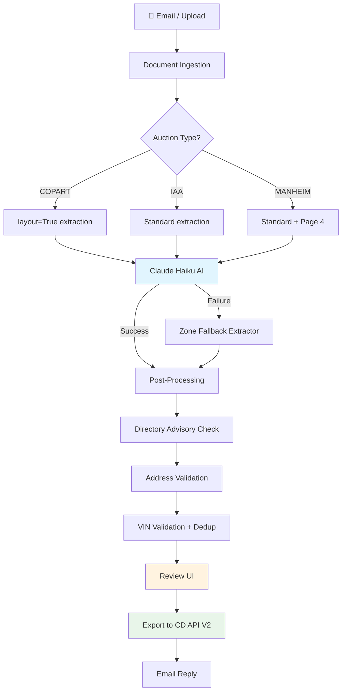

# Y7Dispatch — System Architecture

> Auto-generated from codebase analysis. Last updated: 2026-03-03.

## Table of Contents

1. [System Overview](#1-system-overview)
2. [Technology Stack](#2-technology-stack)
3. [Architecture & Data Flow](#3-architecture--data-flow)
4. [Directory Structure](#4-directory-structure)
5. [Detailed Documentation](#5-detailed-documentation)

---

## 1. System Overview

**Y7Dispatch** is an AI-powered vehicle transport dispatch automation platform. It automates the pipeline from auction invoice ingestion to Central Dispatch listing creation for a vehicle transport company.

### What it does

1. **Ingests** auction invoices (Copart, IAA, Manheim) via email or manual upload
2. **Extracts** vehicle and pickup data from PDFs using Claude Haiku AI
3. **Validates** extracted data against auction directories, NHTSA VIN database, and ZIP codes
4. **Enriches** with warehouse distances, pricing recommendations, weather alerts
5. **Exports** to Central Dispatch API V2 as transport listings
6. **Replies** to original email threads with confirmation details

### Who it's for

Vehicle transport brokers who receive 50-200+ auction invoices daily and need to create CD listings quickly with accurate data.

### Core Integrations

| Integration | Purpose | Auth Method |
|------------|---------|-------------|
| **Central Dispatch API V2** | Create/update transport listings | OAuth2 Client Credentials |
| **Microsoft Graph API** | Email polling + threaded replies | OAuth2 Client Credentials |
| **Anthropic Claude Haiku** | AI document extraction | API Key |
| **NHTSA vPIC API** | VIN decode & validation | None (public) |
| **Google Maps Distance Matrix** | Route distance/duration | API Key |
| **zippopotam.us** | ZIP ↔ city/state cross-check | None (public) |
| **NWS Weather API** | Route weather alerts | None (public) |

---

## 2. Technology Stack

| Layer | Technology |
|-------|-----------|
| **Backend** | Python 3.11+ / FastAPI / Uvicorn |
| **Frontend** | React 18 / Vite 5 / Tailwind CSS 3.3 |
| **Database** | SQLite (single file: `data/control_panel.db`, WAL mode, FK enforced) |
| **AI Extraction** | Anthropic Claude Haiku 4.5 (`claude-haiku-4-5-20251001`) |
| **PDF Parsing** | pdfplumber (text + layout extraction) |
| **HTTP Client** | httpx (sync + async) |
| **Auth** | JWT (httpOnly cookies, single-user mode) |
| **Deployment** | Docker / Docker Compose on Digital Ocean |
| **Credentials** | Fernet encryption in SQLite |

---

## 3. Architecture & Data Flow

### High-Level Pipeline



### Data Flow Detail

```
EMAIL INBOX (Microsoft Graph / IMAP)
    ↓ poll every 5 min, dedup by message_id
DOCUMENT (saved to uploads/, classified by auction type)
    ↓
PDF TEXT (pdfplumber, layout=True for Copart 3-column)
    ↓
HAIKU EXTRACTION (Claude API, cached system prompt)
    ↓ fallback: Zone Extractor templates
POST-PROCESSING (auction-specific: lot cleanup, pickup name)
    ↓
DIRECTORY CHECK (compare doc vs COPART/IAA/MANHEIM_LOCATIONS)
    ↓ _directory_match_status: confirmed | mismatch | not_found
VALIDATION (NHTSA VIN decode, ZIP cross-check, format checks)
    ↓
REVIEW UI (9 sections, field corrections, pricing)
    ↓ field_overrides + operator_overrides
CD PAYLOAD V2 (build_cd_payload → JSON)
    ↓ OAuth2, ETag concurrency, idempotency keys
CENTRAL DISPATCH LISTING (POST /listings)
    ↓
EMAIL REPLY (Microsoft Graph thread reply, HTML template)
```

---

## 4. Directory Structure

```
y7dispatch/
├── api/                           # FastAPI backend
│   ├── main.py                    # App init, middleware, startup, email endpoints
│   ├── models.py                  # Dataclasses, repositories, migrations (2800+ lines)
│   ├── database.py                # SQLite connection pool (get_connection)
│   ├── auth.py                    # JWT middleware
│   ├── cd_client.py               # CD OAuth2 client (token, create/update listing)
│   ├── mi_client.py               # Market Intelligence client
│   ├── listing_fields.py          # Field registry (ListingField, FieldSection, enums)
│   ├── batch_jobs.py              # Batch job orchestration
│   ├── audit_log.py               # Audit trail
│   ├── dlq.py                     # Dead letter queue
│   ├── routes/                    # 36 route files, 249+ endpoints
│   │   ├── extractions.py         # Extraction runs (3100 lines)
│   │   ├── exports.py             # CD export + payload builder (2900 lines)
│   │   ├── documents.py           # Document CRUD (1750 lines)
│   │   ├── reviews.py             # Review workflow
│   │   ├── validation.py          # VIN + address validation trigger
│   │   ├── warehouses.py          # Warehouse CRUD + distance
│   │   ├── pricing.py             # Pricing recommendations
│   │   ├── email_log.py           # Email log + templates
│   │   ├── replies.py             # Email reply send/preview
│   │   └── integrations/          # OAuth, webhooks, CD test
│   ├── services/                  # API-specific services
│   │   ├── address_validator.py   # Pickup address validation
│   │   ├── vin_decoder.py         # NHTSA VIN decode + cache
│   │   └── email_replier.py       # Email reply composition
│   └── workers/
│       └── email_worker.py        # Email polling (IMAP/Graph, 2400 lines)
├── services/                      # Core business logic
│   ├── haiku_extractor.py         # Claude Haiku extraction (primary)
│   ├── auction_directory.py       # Copart/IAA/Manheim location directories
│   ├── distance_service.py        # Google Maps / OSRM / haversine
│   ├── pricing_engine.py          # Pricing recommendations + urgency
│   ├── credential_store.py        # Fernet-encrypted credential storage
│   ├── weather_service.py         # NWS weather alerts
│   └── vin_validator.py           # VIN check digit (ISO 3779)
├── extractors/                    # PDF extraction strategies
│   ├── zone_extractor.py          # Zone-based template extraction (fallback)
│   ├── copart.py                  # Copart-specific rules
│   ├── iaa.py                     # IAA-specific rules
│   ├── manheim.py                 # Manheim-specific rules
│   ├── block_extractor.py         # Layout block detection
│   └── spatial_parser.py          # Bounding box analysis
├── ingest/
│   └── email_reader.py            # GraphEmailReader (Microsoft Graph API)
├── web/                           # React frontend
│   ├── src/
│   │   ├── App.jsx                # Routing, sidebar, auth
│   │   ├── api.js                 # API client (all endpoints)
│   │   ├── pages/                 # Documents, Review, EmailLog, Settings, TestLab
│   │   ├── components/
│   │   │   ├── review/            # 12 Review page sections
│   │   │   ├── settings/          # 6 Settings tabs
│   │   │   ├── documents/         # Documents page components
│   │   │   └── ExportPreviewModal.jsx
│   │   └── hooks/useDocuments.js  # Documents state management
│   └── vite.config.js             # Dev server, API proxy, build output
├── tests/                         # 1459+ tests
│   ├── e2e/                       # 39 E2E test files
│   ├── evaluation/                # Golden dataset accuracy tests
│   └── conftest.py                # Session fixtures
├── scripts/
│   ├── deploy.sh                  # Git pull → npm build → Docker rebuild
│   ├── backup.sh                  # DB + config → tar.gz (30 rotation)
│   └── restore.sh                 # Restore from backup archive
├── docs/                          # Documentation
├── data/                          # SQLite DB (not in git)
├── uploads/                       # Email attachments (not in git)
├── config/                        # Runtime config (not in git)
├── cd_field_mapping_v2.yaml       # CD API V2 field mapping
├── cd_defaults.yaml               # CD default values + conditional rules
├── warehouses.yaml                # Warehouse definitions
├── pricing_config.yaml            # Pricing rules
├── docker-compose.yml             # Single service: app
├── Dockerfile                     # python:3.12-slim + uvicorn
└── CLAUDE.md                      # AI development rules
```

---

## 5. Detailed Documentation

| Document | Contents |
|----------|----------|
| **[EXTRACTION_PIPELINE.md](EXTRACTION_PIPELINE.md)** | Full extraction algorithm, Haiku extractor, zone fallback, auction-specific processing, directory advisory, validation |
| **[CD_INTEGRATION.md](CD_INTEGRATION.md)** | Central Dispatch API V2, OAuth2, payload structure, field mapping, email reply system |
| **[FRONTEND.md](FRONTEND.md)** | React components, pages, routing, Review page sections, export flow |
| **[DATABASE.md](DATABASE.md)** | All tables, schemas, migrations, outputs_json structure |
| **[API_REFERENCE.md](API_REFERENCE.md)** | All endpoints grouped by domain, request/response formats |
