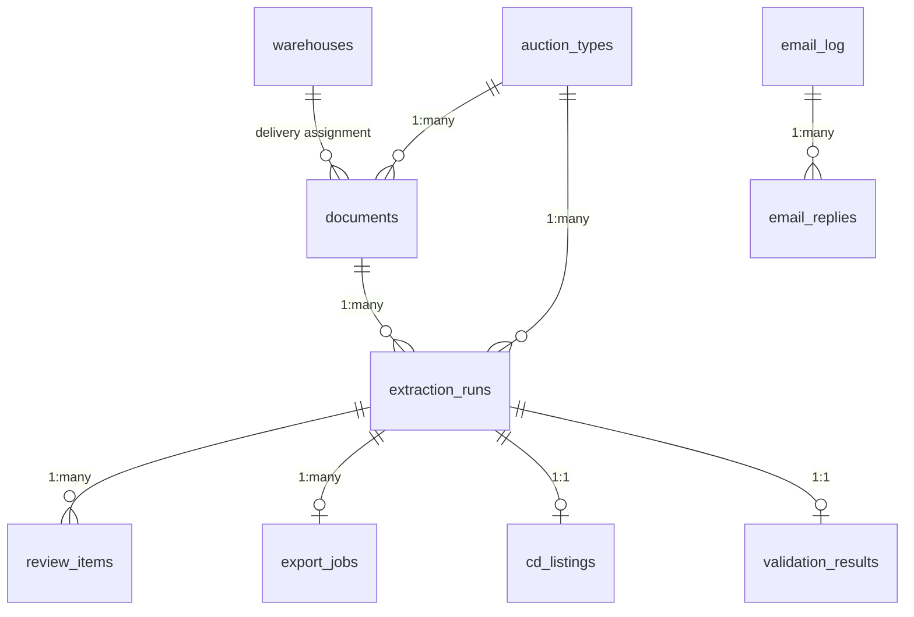

# Database Schema

> SQLite: `data/control_panel.db`. All tables, key fields, relationships.

## Overview

Single SQLite file with 33+ tables. Connection pooling via `get_connection()` context manager (`api/database.py`). Schema created at app startup via init functions in `api/main.py`.

---

## Core Tables

### auction_types
Auction source definitions (Copart, IAA, Manheim, etc.)
```sql
CREATE TABLE auction_types (
    id INTEGER PRIMARY KEY AUTOINCREMENT,
    name TEXT NOT NULL,
    code TEXT NOT NULL UNIQUE,     -- COPART, IAA, MANHEIM, OTHER
    parent_id INTEGER,             -- FK for sub-types
    is_base BOOLEAN DEFAULT 0,
    is_custom BOOLEAN DEFAULT 0,
    is_active BOOLEAN DEFAULT 1,
    description TEXT,
    extractor_config TEXT,         -- JSON extractor settings
    predispatch_notes TEXT,        -- CD pre-dispatch notes per auction
    created_at TIMESTAMP, updated_at TIMESTAMP
)
```

### documents
Uploaded PDF documents.
```sql
CREATE TABLE documents (
    id INTEGER PRIMARY KEY AUTOINCREMENT,
    uuid TEXT UNIQUE,
    auction_type_id INTEGER REFERENCES auction_types(id),
    dataset_split TEXT,            -- train / test
    filename TEXT,
    file_path TEXT,
    file_size INTEGER,
    sha256 TEXT,
    mime_type TEXT,
    page_count INTEGER,
    has_ocr BOOLEAN,
    raw_text TEXT,
    source TEXT,                   -- upload / email / batch / test_lab
    is_test BOOLEAN DEFAULT 0,
    status TEXT DEFAULT 'new',     -- new, processing, ready, needs_review, approved, exported, hold, archived
    pending_reason TEXT,
    created_at TIMESTAMP, uploaded_by TEXT
)
```

### extraction_runs
Each extraction attempt on a document.
```sql
CREATE TABLE extraction_runs (
    id INTEGER PRIMARY KEY AUTOINCREMENT,
    uuid TEXT UNIQUE,
    document_id INTEGER REFERENCES documents(id),
    auction_type_id INTEGER REFERENCES auction_types(id),
    extractor_kind TEXT,           -- rule / ml
    model_version_id INTEGER,
    status TEXT,                   -- pending, processing, completed, failed, needs_review
    extraction_score REAL,
    outputs_json TEXT,             -- Full extraction results (see structure below)
    errors_json TEXT,
    error_message TEXT,
    metrics_json TEXT,
    field_sources_json TEXT,       -- Per-field metadata (source, confidence, method)
    processing_time_ms INTEGER,
    processing_step TEXT,          -- Async progress: extracting_text, calling_haiku, etc.
    processing_message TEXT,       -- Human-readable progress message
    attachments_json TEXT,         -- JSON list of saved attachment info
    created_at TIMESTAMP, completed_at TIMESTAMP
)
```

### review_items
Per-field review state (predicted vs corrected values).
```sql
CREATE TABLE review_items (
    id INTEGER PRIMARY KEY AUTOINCREMENT,
    run_id INTEGER REFERENCES extraction_runs(id),
    source_key TEXT,               -- Original field key from extraction
    internal_key TEXT,             -- Normalized internal key
    cd_key TEXT,                   -- CD API V2 field path
    predicted_value TEXT,          -- Original extracted value
    corrected_value TEXT,          -- User-corrected value (null if unchanged)
    is_match_ok BOOLEAN,
    export_field TEXT,
    confidence REAL,
    status TEXT,                   -- pending, approved, corrected, rejected
    reviewer TEXT,
    review_notes TEXT,
    created_at TIMESTAMP, reviewed_at TIMESTAMP
)
```

### export_jobs
CD export job tracking.
```sql
CREATE TABLE export_jobs (
    id INTEGER PRIMARY KEY AUTOINCREMENT,
    uuid TEXT UNIQUE,
    run_id INTEGER REFERENCES extraction_runs(id),
    dispatch_id TEXT,              -- Load ID (externalId)
    cd_listing_id TEXT,            -- CD-assigned listing ID
    target TEXT DEFAULT 'central_dispatch',
    status TEXT,                   -- pending, submitted, success, failed, validation_error
    payload_json TEXT,             -- Full CD payload sent
    response_json TEXT,            -- CD API response
    error_json TEXT,
    error_message TEXT,
    validation_errors_json TEXT,
    retry_count INTEGER DEFAULT 0,
    created_at TIMESTAMP, submitted_at TIMESTAMP, completed_at TIMESTAMP
)
```

---

## Integration Tables

### cd_listings
Tracks CD listing IDs and ETags for update operations.
```sql
CREATE TABLE cd_listings (
    id INTEGER PRIMARY KEY AUTOINCREMENT,
    run_id INTEGER UNIQUE REFERENCES extraction_runs(id),
    cd_listing_id TEXT NOT NULL,
    etag TEXT,
    external_id TEXT,              -- Our dispatch_id / Load ID
    created_at TIMESTAMP, updated_at TIMESTAMP
)
```

### warehouses
Delivery warehouse definitions.
```sql
CREATE TABLE warehouses (
    id INTEGER PRIMARY KEY AUTOINCREMENT,
    code TEXT UNIQUE,              -- BOS1, NYC2, etc.
    name TEXT,
    address TEXT, city TEXT, state TEXT, zip_code TEXT,
    phone TEXT,                    -- Facility phone → stops[1].phone
    contact_name TEXT,
    contact_phone TEXT,            -- Contact phone → stops[1].contactPhone
    contact_email TEXT,            -- → stops[1].email
    location_type TEXT,
    transport_special_instructions TEXT,
    buyer_reference TEXT,          -- → stops[1].buyerNumber
    is_default BOOLEAN DEFAULT 0,
    is_active BOOLEAN DEFAULT 1,
    latitude REAL, longitude REAL,
    notes TEXT,
    created_at TIMESTAMP, updated_at TIMESTAMP
)
```

### email_log
Email ingestion tracking.
```sql
CREATE TABLE email_log (
    id INTEGER PRIMARY KEY AUTOINCREMENT,
    message_id TEXT UNIQUE,        -- RFC822 Message-ID (dedup key)
    thread_id TEXT,
    sender TEXT, sender_name TEXT,
    subject TEXT,
    received_date TEXT,
    body_preview TEXT,
    has_attachments BOOLEAN,
    attachment_count INTEGER,
    attachment_names TEXT,          -- JSON array
    gate_pass TEXT,                 -- Extracted from email body
    status TEXT DEFAULT 'new',     -- new, ready, processing, processed, skipped, failed, duplicate, thread_reply
    skip_reason TEXT,
    processed_at TEXT,
    extraction_run_ids TEXT,        -- JSON array of linked run IDs
    error_message TEXT,
    graph_message_id TEXT,         -- Microsoft Graph internal ID (for replies)
    created_at TIMESTAMP
)
```

### email_replies
Email reply tracking (idempotent send).
```sql
CREATE TABLE email_replies (
    id INTEGER PRIMARY KEY AUTOINCREMENT,
    email_log_id INTEGER REFERENCES email_log(id),
    run_id INTEGER REFERENCES extraction_runs(id),
    cd_listing_id TEXT,
    status TEXT,                   -- pending, sent, failed
    attempts INTEGER DEFAULT 0,
    last_attempt_at TEXT,
    sent_at TEXT,
    error_message TEXT,
    created_at TIMESTAMP
)
```

### email_templates
Email reply HTML templates.
```sql
CREATE TABLE email_templates (
    id INTEGER PRIMARY KEY AUTOINCREMENT,
    template_key TEXT UNIQUE,      -- reply_confirmation
    subject_template TEXT,
    body_html TEXT,                 -- HTML with {{variable}} placeholders
    description TEXT,
    updated_at TIMESTAMP, updated_by TEXT,
    version INTEGER DEFAULT 1
)
```

### validation_results
VIN + address validation results per run.
```sql
CREATE TABLE validation_results (
    run_id INTEGER PRIMARY KEY,
    vehicle_json TEXT,             -- VIN decode result
    pickup_json TEXT,              -- Address validation result
    summary_json TEXT,             -- Overall pass/fail
    validated_at TEXT
)
```

### vin_duplicates
VIN duplicate detection entries.
```sql
CREATE TABLE vin_duplicates (
    id INTEGER PRIMARY KEY AUTOINCREMENT,
    vin TEXT NOT NULL,
    run_id INTEGER NOT NULL,
    duplicate_run_ids TEXT NOT NULL, -- JSON array
    detected_at TEXT DEFAULT (datetime('now')),
    UNIQUE(vin, run_id)
)
```

### integration_credentials
Encrypted credential storage (Fernet).
```sql
CREATE TABLE integration_credentials (
    id INTEGER PRIMARY KEY AUTOINCREMENT,
    service TEXT UNIQUE,           -- cd_api, email_imap, email_oauth, anthropic, google_maps, sheets
    config_json_encrypted TEXT,    -- Fernet-encrypted JSON
    enabled BOOLEAN,
    last_tested_at TEXT,
    last_test_status TEXT,         -- OK, ERROR, NOT_TESTED
    created_at TIMESTAMP, updated_at TIMESTAMP
)
```

---

## Cache Tables

### distance_cache
Google Maps / OSRM distance cache.
```sql
CREATE TABLE distance_cache (
    id INTEGER PRIMARY KEY,
    from_zip TEXT, to_zip TEXT,
    distance_miles REAL,
    duration_minutes REAL,
    distance_source TEXT,          -- google, osrm, haversine
    created_at TIMESTAMP
)
```

### zip_cache
zippopotam.us ZIP ↔ city/state cache.
```sql
CREATE TABLE zip_cache (
    zip_code TEXT PRIMARY KEY,
    city TEXT, state TEXT,
    cached_at TEXT DEFAULT (datetime('now'))
)
```

### vin_decode_cache
NHTSA VIN decode cache.
```sql
CREATE TABLE vin_decode_cache (
    vin TEXT PRIMARY KEY,
    decoded_json TEXT NOT NULL,
    decoded_at TEXT DEFAULT (datetime('now'))
)
```

---

## Other Tables

| Table | File | Purpose |
|-------|------|---------|
| `field_mappings` | models.py | Field mapping rules per auction type |
| `training_examples` | models.py | ML training data |
| `model_versions` | models.py | Model version tracking |
| `training_jobs` | models.py | Training job tracking |
| `layout_blocks` | models.py | PDF layout block positions |
| `field_evidence` | models.py | Extraction evidence (bbox, source) |
| `extraction_templates` | routes/templates.py | Zone extraction templates |
| `template_versions` | routes/field_mappings.py | Template versioning |
| `load_ids` | routes/listings.py | Load ID tracking |
| `field_configs` | routes/settings.py | Field configuration |
| `oauth_tokens` | routes/integrations/oauth.py | OAuth2 token storage |
| `oauth_states` | routes/integrations/oauth.py | OAuth2 CSRF state |
| `audit_events` | audit_log.py | Audit trail events |
| `dlq_entries` | dlq.py | Dead letter queue |
| `batch_jobs` | batch_jobs.py | Batch operation jobs |
| `production_corrections` | routes/exports.py | Export corrections for ML training |

---

## Key Relationships



---

## outputs_json Field Reference

Internal fields (prefixed with `_`) are metadata, not exported to CD:

| Field | Type | Description |
|-------|------|-------------|
| `_haiku_original_pickup` | dict | Original Haiku pickup values before post-processing |
| `_directory_match_status` | string | confirmed, mismatch, not_found |
| `_directory_suggestion` | dict | Directory data {name, address, city, state, zip} |
| `pickup_verified` | bool | Whether pickup address is directory-verified |
| `gate_pass` | string | Gate pass code from email or document |
| `manheim_release_date` | string | YYYY-MM-DD, AVAILABLE_NOW, or NO_RELEASE_DOCUMENT |
| `manheim_offsite` | bool | Vehicle not at Manheim facility |
