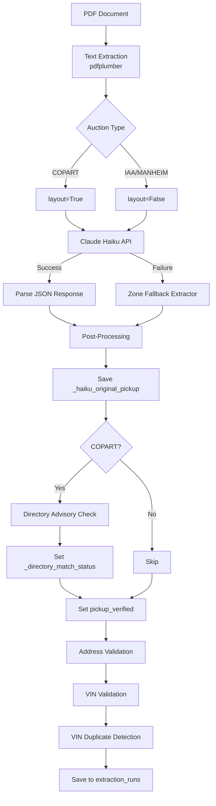

# Extraction Pipeline

> Covers: PDF text extraction → Haiku AI → post-processing → directory advisory → validation → VIN dedup.

## Pipeline Overview



---

## Step 1: Email Monitoring

**Files:** `api/workers/email_worker.py`, `ingest/email_reader.py`

### Protocols
- **Microsoft Graph API** (OAuth2) — primary, supports thread replies
- **IMAP** (password) — fallback for non-Microsoft mailboxes

### Flow
1. Poll every 5 minutes (configurable in Settings > Email)
2. `since_days=7` default lookback; already-processed emails skipped via `message_id` UNIQUE constraint
3. Classify attachments: invoice > listing_page > condition_report > vehicle_release > banking (skip)
4. Extract gate pass from email body (regex: "Gate Pass PIN:", "Gate Pass Code:", etc.)
5. Extract VIN from email subject (17-char alphanumeric pattern)
6. Save PDF to `uploads/email/`, create `documents` + `extraction_runs` records
7. Auto-trigger extraction

### Attachment Classification Priority
```
1. invoice (1-page PDFs = buyer receipts, highest priority)
2. listing_page (ShowReport.pdf, run_and_drive, for_auction)
3. condition_report
4. vehicle_release (Manheim release docs)
5. banking (SKIP — ACH, wire, W9 documents)
6. unknown → promoted to invoice if single; smallest-by-size if multiple
```

---

## Step 2: Document Classification

**File:** `services/haiku_extractor.py:167-289` (EXTRACTION_PROMPT)

Auction type is determined by:
1. User-specified at upload (explicit)
2. Email rules matching sender/subject patterns
3. Haiku extraction from document content (field: `auction_type`)

Values: `COPART` | `IAA` | `MANHEIM` | `UNKNOWN`

---

## Step 3: PDF Text Extraction

**File:** `services/haiku_extractor.py:370-403` — `extract_text_from_pdf()`

```python
def extract_text_from_pdf(pdf_path, use_layout=False):
    # Returns: (text, page_count, original_length)
    # Uses pdfplumber.open() → page.extract_text(layout=use_layout)
    # Pages joined with "\n\n--- Page N ---\n\n"
    # Truncated to MAX_TEXT_LENGTH = 50000 chars
```

| Auction Type | `use_layout` | Why |
|-------------|-------------|-----|
| **COPART** | `True` | 3-column layout (Member / Lot / Seller) — whitespace preserves column boundaries |
| **IAA** | `False` | Single-column layout |
| **MANHEIM** | `False` | Standard layout |

---

## Step 4: Haiku AI Extraction

**File:** `services/haiku_extractor.py:405-672` — `HaikuExtractor.extract()`

### Model & Parameters
- **Model:** `claude-haiku-4-5-20251001`
- **Max tokens:** 4096
- **System prompt:** Cached (Phase 1.6 prompt caching for cost reduction)
- **Retry:** 3 attempts with [1s, 3s, 10s] exponential backoff

### Extracted Fields
```json
{
  "auction_type": "COPART",
  "vehicle_vin": "1C4RJFAG2GC489125",
  "vehicle_year": 2016,
  "vehicle_make": "JEEP",
  "vehicle_model": "GRAND CHEROKEE",
  "vehicle_color": "WHITE",
  "vehicle_type": "SUV",
  "vehicle_lot": "43666048",
  "vehicle_is_inoperable": false,
  "pickup_name": "COPART - AYER",
  "pickup_address": "77 FITCHBURG ROAD",
  "pickup_city": "AYER",
  "pickup_state": "MA",
  "pickup_zip": "01432",
  "buyer_id": "535527",
  "total_amount": 1250.00,
  "sale_date": "2026-02-15",
  "manheim_release_date": "NO_RELEASE_DOCUMENT",
  "manheim_offsite": null
}
```

### Cost Tracking
```python
class TokenUsage:
    # Haiku pricing:
    # Input: $0.25/1M tokens
    # Output: $1.25/1M tokens
    # Cache read: $0.025/1M (90% discount)
    # Cache write: $0.3125/1M (25% premium)
```

---

## Step 5: Zone Fallback Extractor

**File:** `extractors/zone_extractor.py` (1454 lines)

Used when Haiku fails (API down, timeout, invalid response). Extracts from predefined rectangular zones on the PDF page.

### Zone Template Structure
```python
DocumentTemplate:
    template_id: str
    auction_type: str  # COPART, IAA, MANHEIM
    zones: list[DocumentZone]

DocumentZone:
    name: str  # "LOT_ADDRESS", "VEHICLE_INFO"
    x0, y0, x1, y1: float  # Percentage coordinates (0-100%)
    fields: list[ZoneField]

ZoneField:
    key: str  # "pickup_city"
    field_type: FieldType  # TEXT, VIN, ADDRESS, CURRENCY, etc.
    pattern: Optional[str]  # regex
    extract_strategy: str  # "after_label", "regex", "full_zone"
```

### Default Copart Zones
| Zone | Position (X%, Y%) | Fields |
|------|------------------|--------|
| MEMBER_INFO | 0-28.6%, 7.5-20% | buyer_id, buyer_name |
| **LOT_ADDRESS** | **28.6-58.8%, 7.5-20%** | **pickup_name, address, city, state, zip** (correct column) |
| SELLER_INFO | 58.8-100%, 7.5-20% | seller_id, seller_name |
| VEHICLE_INFO | 0-100%, 18-50% | vin, year, make, model, lot |
| FINANCIAL_INFO | 0-100%, 45-95% | sale_price, total_amount |

---

## Step 6: Auction-Specific Post-Processing

**File:** `services/haiku_extractor.py:573-666`

### IAA
- Strip `000-` prefix from lot numbers (e.g., `000-43666048` → `43666048`)

### Copart
1. Save `_haiku_original_pickup` (lines 584-594) — snapshot before any changes
2. Call `_copart_name_from_city(city, fields)` to resolve canonical name
3. **Directory advisory** (compare, never overwrite — see Step 7)
4. Set `pickup_name` from directory (exception: PDFs lack canonical names)
5. Set `pickup_verified` flag

### Manheim
- Extract `manheim_release_date` from "ONSITE VEHICLE RELEASE" section
- Detect `manheim_offsite` (vehicle not at Manheim facility)
- Page 4 pickup location for offsite vehicles

### `_copart_name_from_city()` Lookup Priority
```python
# File: services/haiku_extractor.py:136-163
1. city + state exact match in COPART_LOCATIONS
2. zip code match (fallback for wrong city from 3-column layout)
3. Fallback: "COPART - {CITY}" (not in directory)
```

---

## Step 7: Directory Advisory

**File:** `services/haiku_extractor.py:605-662`

**Principle:** PDF document = primary source. Directory = advisory reference. **Never auto-replace** address fields.

### Flow
1. If directory match found → compare document values against directory (case-insensitive)
2. Set `_directory_match_status`:
   - `confirmed` — all fields match → `pickup_verified = True`
   - `mismatch` — some fields differ → `pickup_verified = False`
   - `not_found` — not in directory → `pickup_verified = False`
3. Set `_directory_suggestion` with directory data for UI display
4. **Pickup name** is still set from directory (PDFs use informal names like "COPART - AYER")

### Auction Directories

**File:** `services/auction_directory.py`

| Directory | Entries | Data per entry |
|-----------|---------|---------------|
| `COPART_LOCATIONS` | ~170 | phone, address, city, state, zip |
| `IAA_LOCATIONS` | ~25 | phone, address, city, state, zip |
| `MANHEIM_LOCATIONS` | ~20 | phone, address, city, state, zip |
| `ADESA_LOCATIONS` | ~30 | phone, address, city, state, zip |
| `AMERICAS_AA_LOCATIONS` | ~20 | phone, address, city, state, zip |
| `AUTONATION_LOCATIONS` | 4 | phone, address, city, state, zip |

---

## Step 8: Address Validation

**File:** `api/services/address_validator.py` — `PickupAddressValidator.validate()`

### Three Steps

1. **Directory comparison** — uses pre-computed `_directory_match_status` + `_directory_suggestion` to avoid circular validation. Falls back to `_lookup_by_zip()` for legacy data or non-Copart.

2. **Format checks:**
   - ZIP: must be 5 digits (`^\d{5}$`)
   - State: must be valid 2-letter US state
   - Address: must not be empty

3. **ZIP ↔ city/state cross-check** via zippopotam.us API (cached in `zip_cache` table)

### Per-Field Statuses
| Status | Meaning |
|--------|---------|
| `verified` | Document value matches directory |
| `mismatch` | Document differs from directory |
| `corrected_by_directory` | Legacy: directory replaced Haiku's value |
| `unverified` | No directory entry found |

---

## Step 9: VIN Validation

**File:** `api/services/vin_decoder.py` — `VINDecoder`

### NHTSA vPIC API
- **Endpoint:** `https://vpic.nhtsa.dot.gov/api/vehicles/DecodeVin/{vin}?format=json`
- **Timeout:** 10 seconds
- **Cache:** `vin_decode_cache` SQLite table

### Validation Logic
- **Year:** exact match required
- **Make:** alias-aware (e.g., "CHEVY" = "CHEVROLET", "VW" = "VOLKSWAGEN")
- **Model:** partial match allowed (e.g., "CAMRY" matches "CAMRY LE")

### VIN Check Digit
**File:** `services/vin_validator.py:4-25` — ISO 3779 check digit validation at position 9.

---

## Step 10: VIN Duplicate Detection

**File:** `api/routes/extractions.py:57-131` — `detect_vin_duplicates()`

- Queries `extraction_runs` for other runs with same `vehicle_vin` in `outputs_json` (uses `idx_runs_vin_expr` expression index on `json_extract(outputs_json, '$.vehicle_vin')` for fast lookups)
- Excludes failed/cancelled runs
- Joins with `email_log` for sender context
- Stores bidirectional entries in `vin_duplicates` table
- UI shows DUP badge + linked email info on Review page

---

## outputs_json Structure

After extraction, all data is stored in `extraction_runs.outputs_json`:

```json
{
  "auction_type": "COPART",
  "vehicle_vin": "1C4RJFAG2GC489125",
  "vehicle_year": "2016",
  "vehicle_make": "JEEP",
  "vehicle_model": "GRAND CHEROKEE",
  "vehicle_color": "WHITE",
  "vehicle_lot": "43666048",
  "vehicle_is_inoperable": false,
  "pickup_name": "Copart North Boston",
  "pickup_address": "77 FITCHBURG ROAD",
  "pickup_city": "AYER",
  "pickup_state": "MA",
  "pickup_zip": "01432",
  "buyer_id": "535527",
  "total_amount": 1250.00,
  "gate_pass": "ABC123",
  "pickup_verified": true,
  "_haiku_original_pickup": {
    "pickup_name": "COPART - AYER",
    "pickup_address": "77 FITCHBURG ROAD",
    "pickup_city": "AYER",
    "pickup_state": "MA",
    "pickup_zip": "01432"
  },
  "_directory_match_status": "confirmed",
  "_directory_suggestion": {
    "name": "Copart North Boston",
    "address": "77 Fitchburg Rd",
    "city": "Ayer",
    "state": "MA",
    "zip": "01432"
  }
}
```
